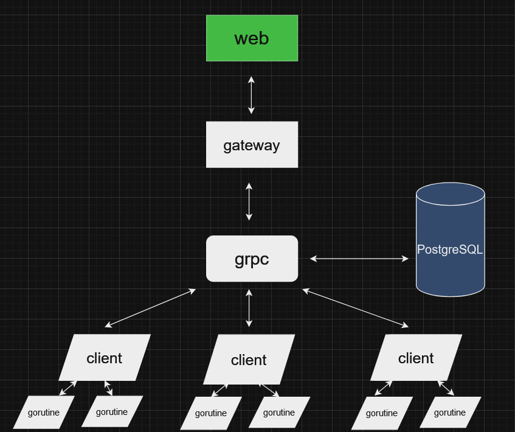

Полурабочий калькулятор
==============


***Содержание:***
- [Описание](#Introduction)
- [Работа сервиса](#Preparing)
- [Как собрать проект](#assembly)
- [Тесты](#Test)


# Описание <a name="Introduction"></a>

**Суть** — Пользователь вводит выражение на выход получает ответ через какой-то промежуток времени.Во время выполнения может следить за статусом воркеров и сам задавать время выполнения оперий. 
Виды операций: +-/*^ 
# Работа сервиса<a name="Preparing"></a>
## Устройство : 
  Redis использьзуется как база данных 
  


Оркестратор получает выражение,после парсит его и начинает раскладывать на под выражения  и отправляет их  в очередь


Количество агентов регулируется в docker-compose.yaml, также как и возможность их рестартов

# Как собрать проект <a name="assembly"></a>

## Требования:
#### Windows
- Docker Desktop
#### Linux
- Docker Engine
- Доступ к sudo/пользователь в группе docker
## Запуск

```bash
docker compose up
```

# Заходим на  localhost:8041
 Если html не работает, то отправляем запрос curl -X POST -H "Content-Type: application/json" -d "{\"expression\": \"2 + 2\"}" http://localhost:8041/set для отправки выражения 
 
 Для получения статуса агентов curl localhost:8041/getstatus
# Тесты <a name="Test"></a> 

1. 1+1=2
2. 5*3=15
3. 3^4=81
4. (5+4)*3/2=13,5
5. 2/0
 
Телеграмм для связи MONOBEARW

